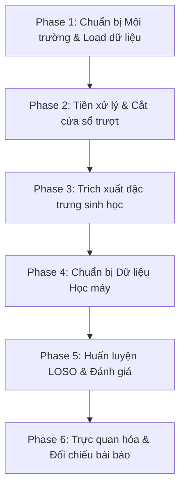

# SIÊU KẾ HOẠCH HÀNH TRÌNH (ULTRA PLAN)
## Tái Hiện Nghiên Cứu WESAD: Phát Hiện Căng Thẳng và Cảm Xúc Bằng Thiết Bị Đeo
### Tài liệu tham khảo: Bài báo ICMI '18 (Schmidt et al.)
### File đích mong muốn: `wesad_pipeline.ipynb` (Jupyter Notebook duy nhất)

Để xây dựng một file Notebook hoàn chỉnh tái hiện chính xác workflow của bài báo khoa học WESAD với tài nguyên token tối ưu, chúng ta sẽ chia dự án thành **6 Giai đoạn (Phases)**. Mỗi giai đoạn được thiết kế dưới dạng một Module độc lập với đầu vào/đầu ra rõ ràng, giúp dễ dàng tích hợp và debug.

---

---

## 📋 TÓM TẮT CÁC GIAI ĐOẠN CHI TIẾT

### GIAI ĐOẠN 1: SETUP MÔI TRƯỜNG & ĐỌC DỮ LIỆU PICKLE (.PKL)
*   **Mục tiêu:** Cài đặt các thư viện chuyên dụng cho phân tích tín hiệu sinh học và đọc thành công dữ liệu của các đối tượng từ `S2` đến `S17`.
*   **Các thư viện cần thiết:**
    *   Phân tích dữ liệu & Tín hiệu: `numpy`, `pandas`, `scipy`, `neurokit2` (thư viện tối quan trọng để xử lý ECG/EDA), `biosppy` (nếu cần).
    *   Học máy: `scikit-learn`, `xgboost`, `lightgbm`.
    *   Trực quan hóa: `matplotlib`, `seaborn`.
*   **Nhiệm vụ chi tiết:**
    1.  Tạo Notebook `wesad_pipeline.ipynb`.
    2.  Viết hàm `load_subject_data(subject_id)` để đọc tệp `.pkl` (sử dụng `encoding='latin1'`).
    3.  Khảo sát kích thước dữ liệu và cấu trúc các khóa (`signal`, `label`, `subject`).

---

### GIAI ĐOẠN 2: TIỀN XỬ LÝ & CẮT CỬA SỔ TRƯỢT (SLIDING WINDOW)
*   **Mục tiêu:** Phân đoạn chuỗi tín hiệu thời gian liên tục thành các cửa sổ ngắn có độ chồng lấp cao nhằm chuẩn bị cho việc trích xuất đặc trưng.
*   **Thông số quy chuẩn từ bài báo:**
    *   **Kích thước cửa sổ (Window Size):** 60 giây đối với tín hiệu sinh học (ECG, BVP, EDA, RESP, TEMP); 5 giây đối với gia tốc (ACC) và EMG.
    *   **Độ dịch chuyển (Step Size):** 0.25 giây (Overlap 99.58% cho cửa sổ 60s).
*   **Nhiệm vụ chi tiết:**
    1.  Lọc bỏ dữ liệu có nhãn không hợp lệ (giữ lại nhãn `1`: Baseline, `2`: Stress, `3`: Amusement).
    2.  Thiết kế hàm cắt cửa sổ trượt hiệu năng cao bằng Numpy để tránh lỗi tràn bộ nhớ (Out-Of-Memory) vì dữ liệu $700\text{ Hz}$ rất lớn.
    3.  Xác định nhãn của mỗi cửa sổ bằng phương pháp lấy nhãn xuất hiện nhiều nhất (Majority Vote/Mode) trong cửa sổ đó.

---

### GIAI ĐOẠN 3: MULTIMODAL FEATURE EXTRACTION (TRÍCH XUẤT ĐẶC TRƯNG ĐA PHƯƠNG THỨC)
> [!IMPORTANT]
> Đây là giai đoạn tốn nhiều tài nguyên tính toán và có độ phức tạp thuật toán cao nhất. Chúng ta sẽ sử dụng **`neurokit2`** để tự động hóa các thuật toán phức tạp này.

*   **Trích xuất đặc trưng theo từng cảm biến (Table 1 trong bài báo):**
    1.  **ECG / BVP (Nhịp tim & HRV):**
        *   Tìm đỉnh R (R-peaks) / đỉnh PPG.
        *   Đặc trưng miền thời gian: *Mean HR, STD HR, RMSSD, SDNN, NN50, pNN50*.
        *   Đặc trưng miền tần số: Năng lượng trong các dải *LF (0.04-0.15Hz), HF (0.15-0.4Hz)* và tỷ lệ *LF/HF*.
    2.  **EDA (Hoạt tính điện da):**
        *   Lọc thông thấp $5\text{ Hz}$.
        *   Phân tách EDA thành **Tonic** (Skin Conductance Level - SCL) và **Phasic** (Skin Conductance Response - SCR).
        *   Tính *Mean, STD, Slope, Min, Max* của SCL.
        *   Tính số lượng đỉnh xung SCR, tổng biên độ các đỉnh xung SCR.
    3.  **RESP (Nhịp thở từ đai đeo ngực):**
        *   Lọc dải thông $0.1 - 0.35\text{ Hz}$.
        *   Tính tỷ lệ thời gian hít vào/thở ra (I/E ratio), Respiration rate, độ căng lồng ngực (stretch).
    4.  **TEMP (Nhiệt độ):**
        *   Tính *Mean, STD, Min, Max, Slope*.
    5.  **ACC (Gia tốc kế):**
        *   Đặc trưng thống kê riêng biệt cho 3 trục X, Y, Z và độ lớn tổng hợp (Magnitude).
        *   Tần số đỉnh (Peak frequency).

---

### GIAI ĐOẠN 4: CHUẨN BỊ DATASET CHO MACHINE LEARNING
*   **Mục tiêu:** Tổng hợp tất cả đặc trưng đã trích xuất của toàn bộ 15 đối tượng thành một DataFrame đồng nhất.
*   **Nhiệm vụ chi tiết:**
    1.  Tạo cột chỉ định `subject_id` để phục vụ cho việc chia nhóm (Group CV).
    2.  Xử lý các giá trị khuyết thiếu (NaN) nếu các thuật toán trích xuất đặc trưng gặp lỗi ở một số cửa sổ nhiễu.
    3.  Chuẩn hóa dữ liệu (Feature Scaling) bằng `StandardScaler` hoặc `MinMaxScaler`.
    4.  Chia tập dữ liệu thành các cấu hình kiểm thử theo bài báo:
        *   *Cấu hình A:* Chỉ dùng dữ liệu đeo cổ tay (E4 - Wrist).
        *   *Cấu hình B:* Chỉ dùng dữ liệu đeo ngực (RespiBAN - Chest).
        *   *Cấu hình C:* Kết hợp cả hai thiết bị (Wrist + Chest).

---

### GIAI ĐOẠN 5: HUẤN LUYỆN LOSO & ĐÁNH GIÁ MÔ HÌNH
> [!IMPORTANT]
> Bắt buộc phải sử dụng phương pháp **Leave-One-Subject-Out (LOSO) Cross-Validation** để đảm bảo mô hình không bị rò rỉ thông tin người dùng và phản ánh đúng thực tế.

*   **Nhiệm vụ chi tiết:**
    1.  Cài đặt vòng lặp LOSO sử dụng `LeaveOneGroupOut` của `scikit-learn`.
    2.  Định nghĩa hai bài toán phân loại:
        *   **Bài toán 1 (Binary):** Căng thẳng vs Bình thường/Giải trí (Stress vs Non-Stress).
        *   **Bài toán 2 (Three-class):** Baseline vs Stress vs Amusement.
    3.  Huấn luyện và so sánh các thuật toán:
        *   *Decision Tree*
        *   *Random Forest* (100 estimators)
        *   *AdaBoost* (với base estimator là Decision Tree)
        *   *Linear Discriminant Analysis (LDA)*
        *   *k-Nearest Neighbors (kNN)*
        *   *XGBoost / LightGBM* (Cải tiến thêm so với bài báo gốc để nâng cao độ chính xác).

---

### GIAI ĐOẠN 6: TRỰC QUAN HÓA & ĐỐI CHIẾU KẾT QUẢ
*   **Mục tiêu:** Tạo ra các báo cáo trực quan sinh động và đối chiếu trực tiếp với các bảng biểu trong bài báo gốc.
*   **Nhiệm vụ chi tiết:**
    1.  Vẽ **Confusion Matrix** (Ma trận nhầm lẫn) của mô hình tốt nhất để phân tích xem mô hình hay nhầm lẫn ở lớp nào (thường bài báo chỉ ra là khó phân biệt Baseline và Amusement).
    2.  Vẽ biểu đồ **Feature Importance** (Độ quan trọng của đặc trưng) để xác định xem cảm biến nào đóng vai trò quyết định trong việc nhận diện stress (kiểm chứng xem tín hiệu hô hấp RESP và biến thiên nhịp tim HRV có thực sự quan trọng nhất như bài báo kết luận hay không).
    3.  Lập bảng so sánh kết quả độ chính xác (Accuracy, F1-score) thu được so với benchmark của bài báo.

---

## 🚀 KẾ HOẠCH HÀNH ĐỘNG TIẾP THEO

Để không làm bạn bị choáng ngợp bởi lượng code khổng lồ, chúng ta sẽ thực hiện từng bước một. 

*   **Bước tiếp theo:** Hãy tạo file notebook `wesad_pipeline.ipynb` và tôi sẽ viết code cho **Giai đoạn 1** và **Giai đoạn 2** trước (gồm các hàm đọc dữ liệu từ các thư mục `S2`-`S17`, lọc nhãn và hàm chia cửa sổ trượt). 
*   Sau khi chạy thành công hai giai đoạn đầu, chúng ta sẽ tiếp tục tích hợp thư viện `neurokit2` để xử lý **Giai đoạn 3** (Trích xuất đặc trưng).

*Bạn đã sẵn sàng để tạo file Notebook và bắt đầu chưa?*
